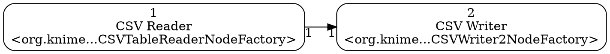

# knime2py — KNIME → Python Workbook

A command-line tool that parses a **KNIME workflow** and emits, for each isolated subgraph (component) inside it:

* a machine-readable graph (`<workflow_id>__gNN.json`)
* a Graphviz DOT file (`<workflow_id>__gNN.dot`)
* a “Python workbook” as either a **Jupyter notebook** (`<workflow_id>__gNN_workbook.ipynb`) or a **Python script** (`<workflow_id>__gNN_workbook.py`) — if you omit `--workbook`, both are generated

> Status: prototype/MVP. KNIME 5.x workflows supported. Legacy (<node>/<connection>) not supported.

---

## Features

* **Single-workflow focus** — point at a `workflow.knime` or a directory containing exactly one `workflow.knime`.
* **Component detection** — splits the workflow into **weakly connected components**; each becomes its own output set with an ID suffix like `__g01`, `__g02`, …
* **KNIME 5.x parser** — reads nodes under `<config key="nodes">/config key="node_*">` and connections under `<config key="connections">/config key="connection_*">`.
* **Depth-ready ordering** - sections are emitted by a deterministic depth-first traversal that only visits a node once all of its predecessors have been visited; in cyclic or disconnected regions it continues depth-first and then appends any remaining nodes in a stable order.
* **Readable workbooks**

  * **Notebook cells**: markdown header like
    `## CSV Reader` followed by `root: \`1\`\` and **Input port(s)/Output port(s)** listing neighbor nodes and ports.
  * **Script stubs**: `def step_<id>_<title>()` with the same metadata in comments.

---

## Requirements

* Python 3.8+
* [`lxml`](https://lxml.de/) (XML parsing)
* (Optional) Graphviz CLI to render `.dot` (`dot`, `neato`, etc.)

---

## Quick start

```bash
# From the repo root:
# Generate BOTH notebook and script (default when --workbook is omitted)
python k2p.py /path/to/workflow.knime --out out_dir

# Or pass a directory that contains exactly one workflow.knime
python k2p.py /path/to/knime_project_dir --out out_dir

# Only notebook
python k2p.py /path/to/workflow.knime --out out_dir --workbook ipynb

# Only script
python k2p.py /path/to/workflow.knime --out out_dir --workbook py
```

Outputs are written to `out_dir/` with one set **per component**:

```
<base>__g01.json
<base>__g01.dot
<base>__g01_workbook.ipynb
<base>__g01_workbook.py
<base>__g02.json
…
```

`<base>` is the workflow directory name; `__gNN` is the component index.

---

## CLI

```
usage: k2p.py [-h] [--out OUT] [--workbook {py,ipynb}] path

positional arguments:
  path                  Path to a workflow.knime file OR a directory containing exactly one workflow.knime

options:
  -h, --help            Show help message and exit
  --out OUT             Output directory (default: out_graphs)
  --workbook {py,ipynb}
                        Workbook format to generate. Omit to generate both.
```

---

## What gets emitted

### Graph JSON (per component)

* Nodes keyed by KNIME node id (strings)
* Edges with `source`, `target`, and optional `source_port` / `target_port`
* Node `name`, `type` (factory class), and `path` when discoverable

### Graphviz DOT (per component)

Left-to-right graph with node labels:



Render example:

```bash
dot -Tpng <base>__g01.dot -o component01.png
```

### Workbooks (per component)

**Notebook (`.ipynb`)**
For each node, a markdown cell like:

```
## CSV Reader
 root: `1`
 Input port(s):
 - from `…` (Upstream Title) [in:1]

 Output port(s):
 - to `2` (CSV Writer) [out:1]
```

followed by a code stub that references a shared `context` dict.

**Script (`.py`)**
Functions named `step_<id>_<title>()` with the same metadata embedded as comments, and a `run_all()` that calls steps in topological order.

---

## KNIME compatibility

* **Supported:** KNIME 5.x exports where `workflow.knime` stores nodes under `<config key="nodes">` and connections under `<config key="connections">`.
* **Not supported:** older “legacy” exports using `<node>`/`<connection>` only.
* **Components/metanodes/loops:** each discovered `workflow.knime` is parsed; nested workflows are treated independently if you run the CLI for them.

If your workflow variant isn’t parsed, share a small repro and we’ll extend the XPath.

---

## Development & Tests

* Repo organizes logic under the `knime2py/` package; the CLI is `k2p.py`.
* Tests live under `tests/`. Run from the repo root:

  ```bash
  pytest -q
  ```

---

## License

MIT

---

## Acknowledgements

KNIME® is a trademark of KNIME AG. This project is an independent community effort and is not affiliated with KNIME AG.
