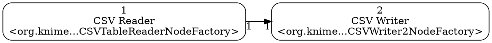

# knime2py — KNIME → Python Workbook

**knime2py** is a code-generation and KNIME→Python exporter: it parses a KNIME workflow, reconstructs its nodes and connections, and emits runnable Python “workbooks” (Jupyter notebook or script) by translating supported KNIME nodes into idiomatic pandas / scikit-learn code via a pluggable node registry. Alongside the executable code, it also writes a machine-readable graph (JSON) and a Graphviz DOT file, preserving port wiring and execution order so the generated Python mirrors the original workflow.

> **Status:** prototype/MVP. KNIME 5.x workflows supported. Legacy exports that rely solely on `<node>` / `<connection>` aren’t supported yet.

---

## Features

- **Single-workflow focus** — point at a `workflow.knime` or a directory containing exactly one `workflow.knime`.
- **Isolated graphs detection** — splits the workflow into **unconnected graphs**; each becomes its own output set with an ID suffix like `__g01`, `__g02`, …
* **Depth-ready ordering** — sections are emitted by a deterministic depth-first traversal that only visits a node once all of its predecessors have been visited; in cyclic or disconnected regions it continues depth-first and then appends any remaining nodes in a stable order.

---

## Requirements

- **For source install:** Python **3.9+** (project is developed/tested on 3.11).
- Runtime libraries used by generated code: `pandas`, `scikit-learn` (installed automatically when using Docker/PEX; for source installs, see below).
- Optional: Graphviz CLI (`dot`) if you want to render `.dot` files to images. The tool always writes `.dot`; rendering is up to you.

---

## Installation & Distribution Options

You can use knime2py in three ways:

### 1) Docker image (no local Python/pip needed)

Pull and run the published image (GHCR):

```bash
docker pull ghcr.io/vitaly-chibrikov/knime2py:latest
docker run --rm ghcr.io/vitaly-chibrikov/knime2py:latest --help
````

Typical run (simple mounts):

```bash
docker run --rm \
  -v "$PWD/workflow":/wf:ro \
  -v "$PWD/out":/out \
  ghcr.io/vitaly-chibrikov/knime2py:latest \
  /wf --out /out --workbook both
```

Preserve **host absolute paths** in generated code (mirror the path inside the container):

```bash
docker run --rm \
  -u "$(id -u):$(id -g)" \
  -v "$PWD":"$PWD" \
  -w "$PWD" \
  ghcr.io/vitaly-chibrikov/knime2py:latest \
  "$PWD/workflow" --out "$PWD/out" --graph off
```

A helper script is available:
`k2p_docker.sh` — [https://github.com/vitaly-chibrikov/knime2py/blob/main/k2p\_docker.sh](https://github.com/vitaly-chibrikov/knime2py/blob/main/k2p_docker.sh)

### 2) PEX single-file binaries (require Python **3.11** on the user’s machine)

Download OS-specific binaries from **Releases**:
[https://github.com/vitaly-chibrikov/knime2py/releases](https://github.com/vitaly-chibrikov/knime2py/releases)

* **macOS / Linux**

  ```bash
  python3 --version      # must be 3.11.x
  chmod +x k2p-macos-<arch>.pex    # or: k2p-linux.pex
  python3 k2p-macos-<arch>.pex --help

  # Example
  python3 k2p-macos-<arch>.pex /path/to/workflow --out /path/to/out --graph off
  ```

* **Windows (PowerShell)**

  ```powershell
  py -3.11 k2p-windows.pex --help
  py -3.11 k2p-windows.pex C:\path\to\workflow --out C:\path\to\out --graph off
  ```

On first run, PEX materializes a managed virtualenv in `~/.pex` (or `%USERPROFILE%\.pex`); no network access is needed at runtime since dependencies are bundled.

### 3) Source (developer) install

```bash
python -m pip install --upgrade pip
pip install -e .
# optional: run tests
pytest -q
```

---

## Quick start (CLI)

The console entrypoint is **`k2p`**. You can also use `python -m knime2py`.

```bash
# Generate BOTH notebook and script (omit --workbook)
k2p /path/to/workflow.knime --out out_dir

# Or pass a directory that contains exactly one workflow.knime
k2p /path/to/knime_project_dir --out out_dir

# Only notebook
k2p /path/to/workflow.knime --out out_dir --workbook ipynb

# Only script
k2p /path/to/workflow.knime --out out_dir --workbook py

# Disable graph files
k2p /path/to/workflow.knime --out out_dir --graph off
```

Outputs are written to `out_dir/` with one set **per component**:

```
<base>__g01.json
<base>__g01.dot
<base>__g01_workbook.ipynb
<base>__g01_workbook.py
<base>__g02.json
…
```

`<base>` is the workflow directory name; `__gNN` is the component index.

---

## CLI reference

```
usage: k2p [-h] [--out OUT] [--workbook {py,ipynb}] [--graph {dot,json,off}] path

positional arguments:
  path                  Path to a workflow.knime file OR a directory containing exactly one workflow.knime

options:
  -h, --help            Show help message and exit
  --out OUT             Output directory (default: out_graphs)
  --workbook {py,ipynb} Workbook format to generate. Omit to generate both.
  --graph {dot,json,off}
                        Which graph file(s) to emit. Omit to generate both; use "off" to skip.
```

---

## What gets emitted

### Graph JSON (per component)

* Nodes keyed by KNIME node id (strings)
* Edges with `source`, `target`, and optional `source_port` / `target_port`
* Node `name`, `type` (factory class), and `path` when discoverable

### Graphviz DOT (per component)

Left-to-right graph with node labels; for example:



Render:

```bash
dot -Tpng <base>__g01.dot -o component01.png
```

### Workbooks (per component)

* **Notebook (`.ipynb`)**: one markdown cell + one code cell per node; shared `context` dict.
* **Script (`.py`)**: `node_<id>_<title>()` functions, **single consolidated import block**, shared `context`, `run_all()`.

---

## Implemented node generators

List of all implemented nodes is here: https://vitaly-chibrikov.github.io/knime2py/implemented.html

> If a node type isn’t implemented, a clear TODO stub is emitted with all paramaters from node's settings.xml file initialized.

---

## Reproducibility & randomness

Some KNIME nodes involve randomness (e.g., **Partitioning**, **Equal Size Sampling**). The generated Python uses pandas/scikit-learn RNGs. Even with the same seed, exact row identities can differ from KNIME’s RNG. We guarantee:

* **Class proportions and split sizes** match the requested settings.
* With identical inputs and seed, Python runs are reproducible **within Python**.
* Stratification preserves target distribution; infeasible cases fall back safely.

**Compare sizes/distributions, not exact row sets.**

---

## Releases

* **Docker image:** `ghcr.io/vitaly-chibrikov/knime2py:latest` (and versioned tags).
* **PEX binaries:** download OS-specific files from **Releases**:
  [https://github.com/vitaly-chibrikov/knime2py/releases](https://github.com/vitaly-chibrikov/knime2py/releases)
  Requires Python **3.11** on the target machine.

---

## License

MIT

---

## Acknowledgements

KNIME® is a trademark of KNIME AG. This project is an independent community effort and is not affiliated with KNIME AG.