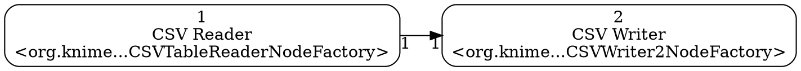

# knime2py — KNIME → Python Workbook

A command-line tool that parses a **KNIME workflow** and emits, for each isolated subgraph (component) inside it:

* a machine-readable graph (`<workflow_id>__gNN.json`)
* a Graphviz DOT file (`<workflow_id>__gNN.dot`)
* a “Python workbook” as either a **Jupyter notebook** (`<workflow_id>__gNN_workbook.ipynb`) or a **Python script** (`<workflow_id>__gNN_workbook.py`) — if you omit `--workbook`, both are generated

> Status: prototype/MVP. KNIME 5.x workflows supported. Legacy (<node>/<connection>) not supported.

---

## Features

* **Single-workflow focus** — point at a `workflow.knime` or a directory containing exactly one `workflow.knime`.
* **Component detection** — splits the workflow into **weakly connected components**; each becomes its own output set with an ID suffix like `__g01`, `__g02`, …
* **KNIME 5.x parser** — reads nodes under `<config key="nodes">/config key="node_*">` and connections under `<config key="connections">/config key="connection_*">`.
* **Depth-ready ordering** — sections are emitted by a deterministic depth-first traversal that only visits a node once all of its predecessors have been visited; in cyclic or disconnected regions it continues depth-first and then appends any remaining nodes in a stable order.
* **Readable workbooks**

  * **Notebook cells**: markdown header like `## CSV Reader` followed by `root: \`1\`\` and **Input/Output** summaries.
  * **Script**: functions named `node_<id>_<safe_title>()` with the same metadata in comments, plus a `run_all()` that executes nodes in order.
* **Import preamble (scripts)** — each node declares imports via `generate_imports()`. The codegen aggregates these and **emits a single import block at the top of the `.py`** so there are no duplicate per-node imports and things like `pd` are defined before any node runs.

---

## Requirements

* Python 3.8+
* [`lxml`](https://lxml.de/) (XML parsing)
* [`pandas`](https://pandas.pydata.org/) (generated code uses it)
* [`scikit-learn`](https://scikit-learn.org/) (used by some nodes, e.g., Partitioning, Equal Size Sampling)
* (Optional) Graphviz CLI to render `.dot` (`dot`, `neato`, etc.)

---

## Quick start

```bash
# From the repo root:
# Generate BOTH notebook and script (default when --workbook is omitted)
python k2p.py /path/to/workflow.knime --out out_dir

# Or pass a directory that contains exactly one workflow.knime
python k2p.py /path/to/knime_project_dir --out out_dir

# Only notebook
python k2p.py /path/to/workflow.knime --out out_dir --workbook ipynb

# Only script
python k2p.py /path/to/workflow.knime --out out_dir --workbook py
```

Outputs are written to `out_dir/` with one set **per component**:

```
<base>__g01.json
<base>__g01.dot
<base>__g01_workbook.ipynb
<base>__g01_workbook.py
<base>__g02.json
…
```

`<base>` is the workflow directory name; `__gNN` is the component index.

---

## CLI

```
usage: k2p.py [-h] [--out OUT] [--workbook {py,ipynb}] path

positional arguments:
  path                  Path to a workflow.knime file OR a directory containing exactly one workflow.knime

options:
  -h, --help            Show help message and exit
  --out OUT             Output directory (default: out_graphs)
  --workbook {py,ipynb}
                        Workbook format to generate. Omit to generate both.
```

---

## What gets emitted

### Graph JSON (per component)

* Nodes keyed by KNIME node id (strings)
* Edges with `source`, `target`, and optional `source_port` / `target_port`
* Node `name`, `type` (factory class), and `path` when discoverable

### Graphviz DOT (per component)

Left-to-right graph with node labels:



Render example:

```bash
dot -Tpng <base>__g01.dot -o component01.png
```

### Workbooks (per component)

**Notebook (`.ipynb`)**
For each node, a markdown cell (title + port summaries) followed by a code cell that references a shared `context` dict.

**Script (`.py`)**
Functions named `node_<id>_<title>()` with the same metadata embedded as comments, a **single import preamble**, a shared `context` dict, and a `run_all()` that calls nodes in topological order.

---

## Implemented node generators (MVP)

* CSV Reader / CSV Writer
* Column Filter
* Missing Value
* Normalizer (Min–Max, Z-Score)
* Rule Engine (subset; see below)
* Partitioning (relative/absolute; random, linear, stratified) — uses `sklearn.model_selection.train_test_split`
* Equal Size Sampling (class balancing) — uses scikit-learn-based resampling

> If a node type isn’t recognized, a clear TODO stub is emitted with a link to its KNIME Hub page (when available).

### Rule Engine subset

We currently parse a pragmatic subset:

* numeric/string comparisons like
  `$col$ > 5 => "label"`
* LIKE with `*` wildcards (compiled to regex) like
  `$col$ LIKE "*blue*" => "label"`
* default catch-all:
  `TRUE => "fallback"`

Unsupported/complex rules are skipped with a `# TODO` comment, and the rest of the rules still apply in order.

---

## Reproducibility & randomness

Some KNIME nodes involve randomness (e.g., **Partitioning**, **Equal Size Sampling**). Our generated Python uses **pandas** and **scikit-learn** RNGs. Even when the same seed value is used, **row-for-row results may differ from KNIME’s internal RNG**. What we do guarantee:

* **Class proportions and train/test sizes** match the requested settings.
* With the same inputs and seed, Python runs are reproducible within Python.
* Stratified operations preserve target distribution; when stratification is infeasible (e.g., minuscule classes), a guarded fallback is used.

In other words, **statistics match, but exact row identities may not**. Tests should compare **sizes and distributions**, not exact row sets.


---

## KNIME compatibility

* **Supported:** KNIME 5.x exports where `workflow.knime` stores nodes under `<config key="nodes">` and connections under `<config key="connections">`.
* **Not supported:** older “legacy” exports using `<node>`/`<connection>` only.
* **Components/metanodes/loops:** each discovered `workflow.knime` is parsed; nested workflows are treated independently if you run the CLI for them.

If your workflow variant isn’t parsed, share a small repro and we’ll extend the XPath.

---

## Development & Tests

* Code lives under `knime2py/`. The CLI entry is `k2p.py`.
* Tests live under `tests/`. Run from the repo root:

  ```bash
  pytest -q
  ```

---

## License

MIT

---

## Acknowledgements

KNIME® is a trademark of KNIME AG. This project is an independent community effort and is not affiliated with KNIME AG.
