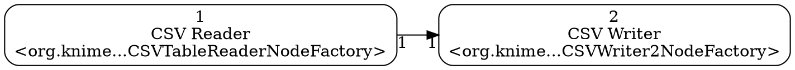

# knime2py — KNIME → Python Workbook

**knime2py** is a code-generation and KNIME→Python exporter: it parses a KNIME workflow, reconstructs its nodes and connections, and emits runnable Python “workbooks” (Jupyter notebook or script) by translating supported KNIME nodes into idiomatic pandas / scikit-learn code via a pluggable node registry. Alongside the executable code, it also writes a machine-readable graph (JSON) and a Graphviz DOT file, preserving port wiring and execution order so the generated Python mirrors the original workflow.

---

## Features
- **Single-workflow focus** — pass either a `workflow.knime` file or a directory that directly contains `workflow.knime`. Subdirectories are not traversed.
- **Components** — nested component workflows aren’t auto-discovered, but they are supported if you point directly at the component’s folder (it also has its own `workflow.knime`).
- **Isolated graphs detection** — splits the workflow into **unconnected graphs**; each becomes its own output set with an ID suffix like `__g01`, `__g02`, …
* **Depth-ready ordering** — sections are emitted by a deterministic depth-first traversal that only visits a node once all of its predecessors have been visited; in cyclic or disconnected regions it continues depth-first and then appends any remaining nodes in a stable order.

---

## Requirements

- **For source install:** Python **3.9+** (project is developed/tested on 3.11).
- Runtime libraries used by generated code: `pandas`, `scikit-learn` (installed automatically when using Docker/PEX; for source installs, see below).
- Optional: Graphviz CLI (`dot`) if you want to render `.dot` files to images. The tool always writes `.dot`; rendering is up to you.

---

## Documentation

MkDocs documentation is here: https://vitalii-kaplan.github.io/knime2py/

---

## Installation & Distribution Options

See the installation guide:  
https://vitalii-kaplan.github.io/knime2py/installation/

---

## Quick start (CLI)

See the quick start:  
https://vitalii-kaplan.github.io/knime2py/quickstart/

---

## CLI reference

```
usage: k2p [-h] [--out OUT] [--workbook {py,ipynb}] [--graph {dot,json,off}] path

positional arguments:
  path                  Path to a workflow.knime file OR a directory containing exactly one workflow.knime

options:
  -h, --help            Show help message and exit
  --out OUT             Output directory (default: out_graphs)
  --workbook {py,ipynb} Workbook format to generate. Omit to generate both.
  --graph {dot,json,off}
                        Which graph file(s) to emit. Omit to generate both; use "off" to skip.
```

---

## What gets emitted

### Graph JSON (per component)

* Nodes keyed by KNIME node id (strings)
* Edges with `source`, `target`, and optional `source_port` / `target_port`
* Node `name`, `type` (factory class), and `path` when discoverable

### Graphviz DOT (per component)

Left-to-right graph with node labels; for example:



Render:

```bash
dot -Tpng <base>__g01.dot -o component01.png
```

### Workbooks (per component)

* **Notebook (`.ipynb`)**: one markdown cell + one code cell per node; shared `context` dict.
* **Script (`.py`)**: `node_<id>_<title>()` functions, **single consolidated import block**, shared `context`, `run_all()`.

---

## Implemented node exporters

List of all implemented nodes is here: https://vitalii-kaplan.github.io/knime2py/src/knime2py/nodes/

> If a node type isn’t implemented, a clear TODO stub is emitted with all paramaters from node's settings.xml file initialized.

---

## Reproducibility & randomness

Some KNIME nodes involve randomness (e.g., **Partitioning**, **Equal Size Sampling**). The generated Python uses pandas/scikit-learn RNGs. Even with the same seed, exact row identities can differ from KNIME’s RNG. We guarantee:

* **Class proportions and split sizes** match the requested settings.
* With identical inputs and seed, Python runs are reproducible **within Python**.
* Stratification preserves target distribution; infeasible cases fall back safely.

**Compare sizes/distributions, not exact row sets.**

---

## Releases

* **Docker image:** `ghcr.io/vitalii-kaplan/knime2py:latest` (and versioned tags).
* **PEX binaries:** download OS-specific files from **Releases**:
  [https://github.com/vitalii-kaplan/knime2py/releases](https://github.com/vitalii-kaplan/knime2py/releases)
  Requires Python **3.11** on the target machine.

---

## License

MIT

---

## Acknowledgements

KNIME® is a trademark of KNIME AG. This project is an independent community effort and is not affiliated with KNIME AG.