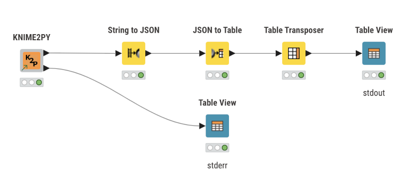
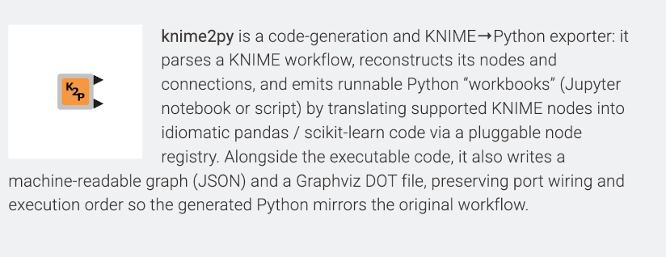
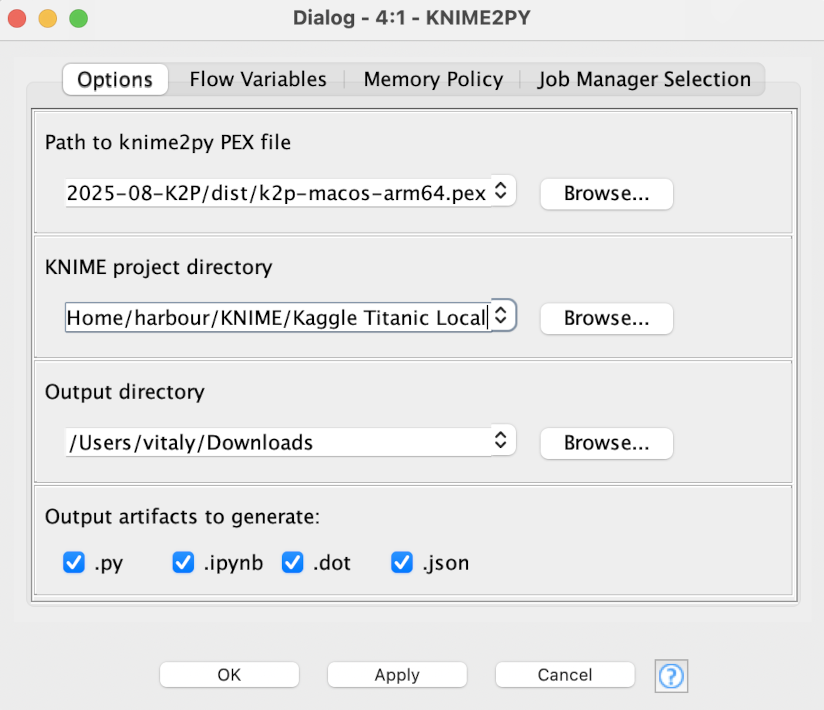

# KNIME UI Component



This page explains how to run **knime2py** from a simple KNIME **Component** UI: you point it at a KNIME workflow, choose which artifacts to emit, and it generates Python workbooks plus graph files into a target folder.

> If you prefer the CLI, see **Quickstart** in the docs. The UI component is just a thin front-end around the same `k2p` entrypoint.

---

## What the component does

- Accepts a **workflow path** (`workflow.knime` or a folder containing exactly one `workflow.knime`).
- Writes outputs into an **output directory** you choose.
- Lets you select which artifacts to emit:
  - Python script (`.py`)
  - Jupyter notebook (`.ipynb`)
  - Graphviz DOT (`.dot`)
  - Machine-readable graph JSON (`.json`)

The generated Python mirrors the KNIME workflow’s node order and port wiring and uses idiomatic **pandas** / **scikit-learn** in a shared `context` dictionary.

---

## Prerequisites

- KNIME Analytics Platform **5.x**
- A working **knime2py** executable **PEX**: a local `k2p-*.pex` (Python 3.11 required to run)

Verify the binary once on your machine:

```bash
python3 k2p-<YOUR_OS>.pex --help
```

---

## Install the component

Open the [**KNIME Hub**](https://hub.knime.com/vitaliikaplan/spaces/Public/KNIME2PY~cByfLsPjmjzcKBJm/current-state?pk_vid=d2f8fa22c6beb8dd17619267224cb2a5) page for the component.
   Drag-and-drop it into your workflow (or “Open in KNIME”, then copy into your project).

   *Component on Hub:*
   

You will see a **single Component node** in your canvas:

   *Component on canvas:*
   

---

## Configure

Double-click the component (or right-click → **Configure**). Fill in:

* **k2p_bin**: Full path to the `k2p` executable you will use.
  Examples:
  * `/Users/you/bin/k2p-macos-arm64.pex`
  * `C:\Users\you\bin\k2p-windows.pex`
* **k2p_workflow**: Path to the KNIME workflow you want to export.
  * Either `/path/to/workflow.knime`
  * Or a directory that **directly** contains `workflow.knime`
* **output_dir**: Directory where artifacts will be written (will be created if missing).
* **Selection table**: One column with any of `.py`, `.ipynb`, `.dot`, `.json` (one row per item).
  Leave blank to default to a safe set (script + JSON + DOT).

*Configuration dialog:*


Notes:

* Graph rendering is not automatic; knime2py writes a `.dot` file. Render with Graphviz, e.g.:

  ```bash
  dot -Tpng out/COMPONENT__g01.dot -o out/COMPONENT__g01.png
  ```

---

## Run

Click **Execute**. When it finishes:

* Open the **output folder** to see generated files:

  ```
  <base>__g01.json
  <base>__g01.dot
  <base>__g01_workbook.py
  <base>__g01_workbook.ipynb
  <base>__g02.json
  …
  ```

  where `<base>` is the workflow directory name and `__gNN` is the component index.

---

## Troubleshooting

* **Nothing is generated**

  * Re-check `k2p_bin` points to a real executable; run it in a terminal to confirm.
  * Verify `k2p_workflow` is a file named `workflow.knime` or a directory containing exactly one `workflow.knime`.
* **PEX won’t run**

  * Use Python **3.11** to execute the `.pex` file: `python3 k2p-*.pex --help`
* **DOT won’t preview**

  * Install Graphviz and render manually with `dot -Tpng …`.
* **Permissions / paths**

  * On macOS, if running from protected folders (Desktop/Documents), grant KNIME disk access or copy the workflow elsewhere.

---

## How it works (internals)

The component is a thin wrapper around the CLI:

* Reads your selections (ports/paths) from the dialog.
* Constructs the `k2p` invocation.
* Runs it and reports success/failure.
* It does **not** alter your KNIME workflow; files are written only to `output_dir`.

If you need more control (e.g., Docker runs, custom flags), use the **CLI** directly as described in **Quickstart**.

---

## See also

* [**Implemented nodes**](`/knime2py/src/knime2py/nodes/`)
* [**CLI reference & examples**](/knime2py/quickstart/)
